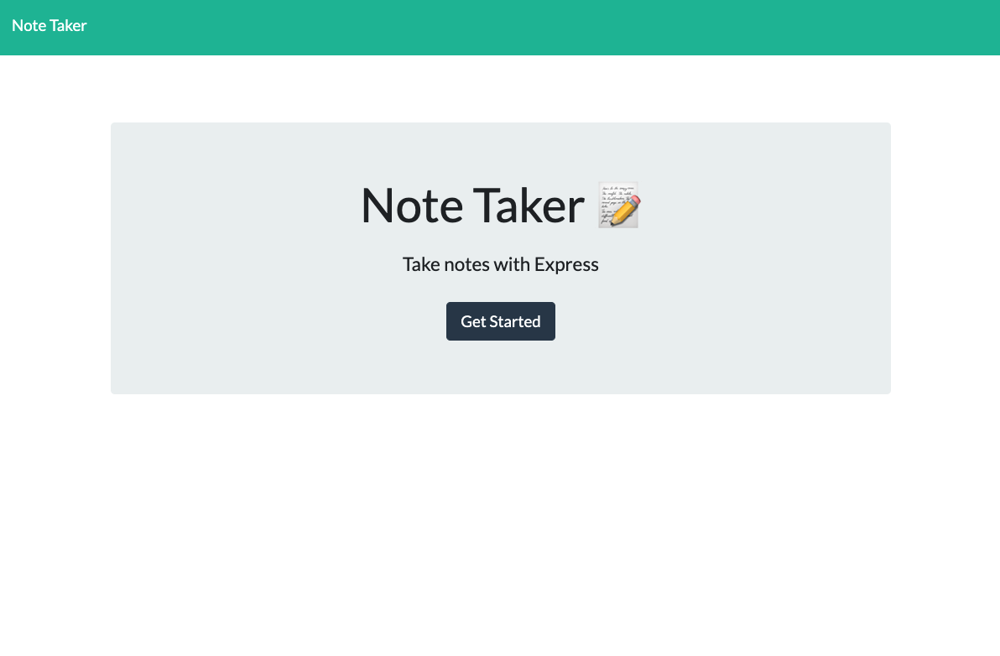
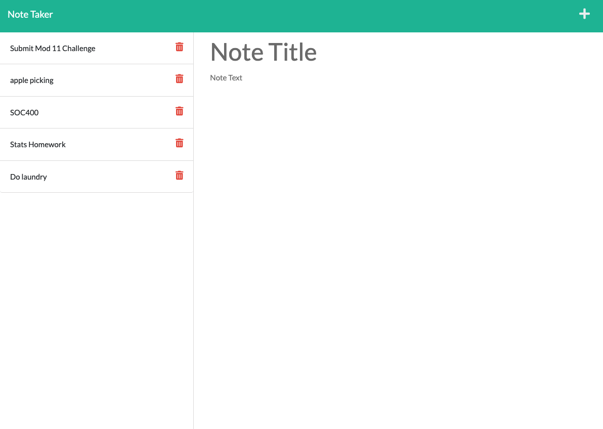

# Note Taker Application

## Description

- This application is intended to allow users to create notes with a title and a body. Notes will be saved and have the ability to be deleted.

## Installation

Simply click the link to the deployed application on heroku.

- [Deployed Note Taker App](https://safe-beach-19758.herokuapp.com/notes)

## Usage

The purpose of this application is for users to be able to easily make notes on any subject matter they wish. There will be a spot for notes title and a spot to enter the body of the notes. Notes can be saved by click of the save icon, new notes can be added by clicking the add icon, and notes can also be deleted by clicking the trash icon next to the particular note users wish to delete.

## Built with:

- HTML
- CSS
- JavaScript
- Node.js
- Express.js

## This application can be found:

- [GitHub Repository](https://github.com/michellewehr/note-taker)
- [Heroku- Deployed App](https://safe-beach-19758.herokuapp.com/notes)

## Contribution

Anyone is welcome to contribute to this project. To do so, clone the local repository to your local workspace, install the dependencies to run the code using "npm install" in your terminal,create a git feature branch and request a pull request. Upon review, the pull request will then be accepted or denied.

## Sources

- Starter code was provided by Xandromus.
- The github repo that was provided has the following link: https://github.com/coding-boot-camp/miniature-eureka

## Author

Michelle Wehr
